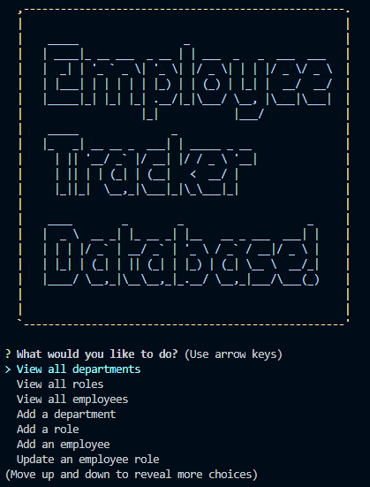
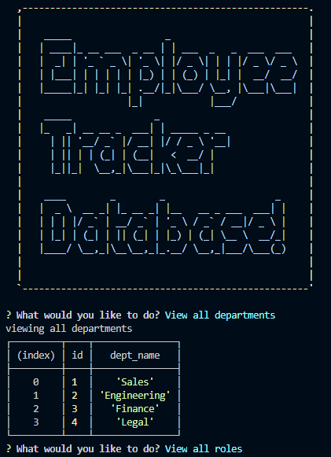
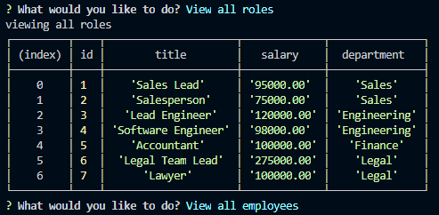
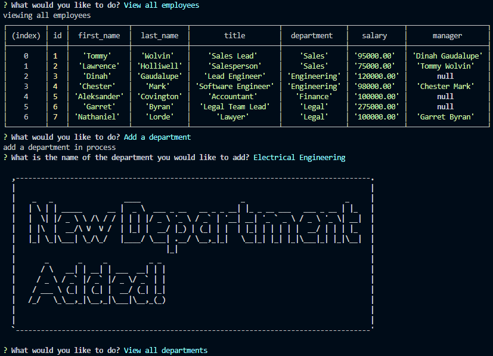
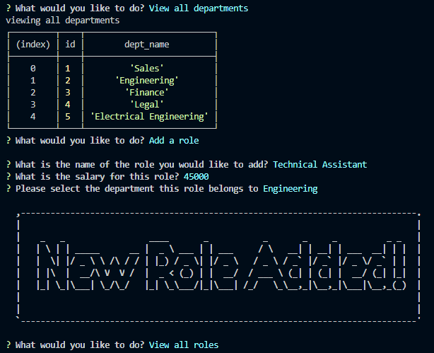
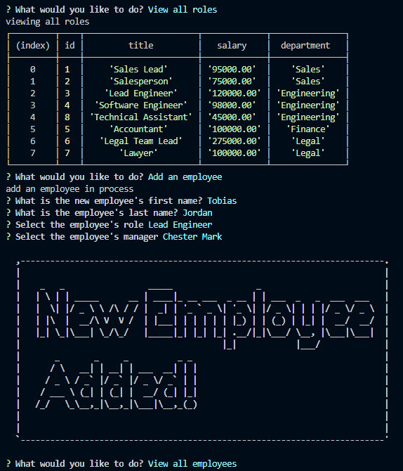
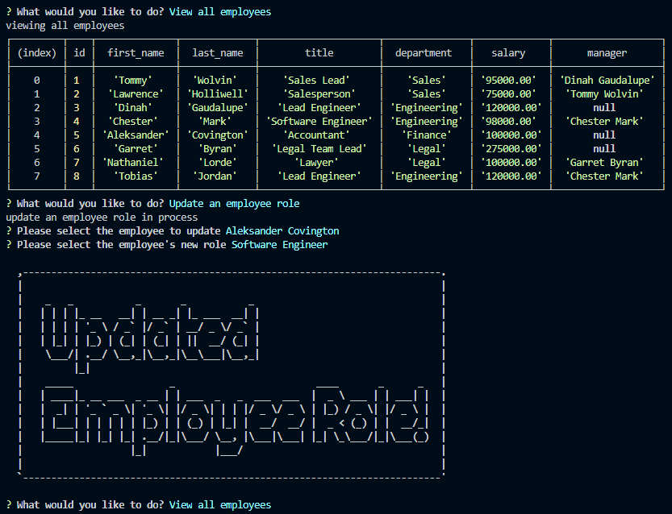
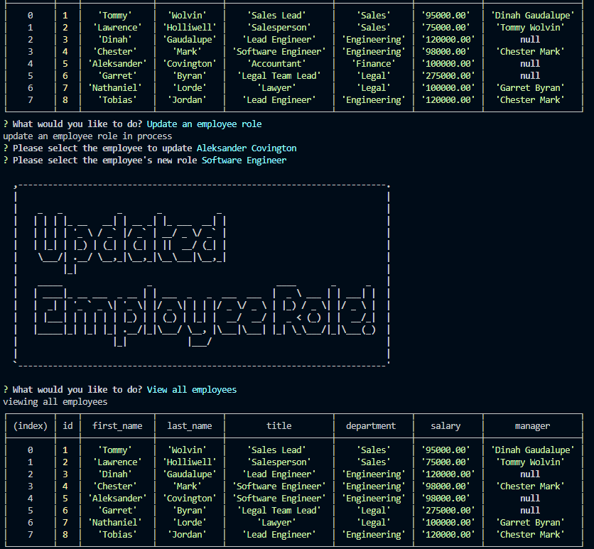
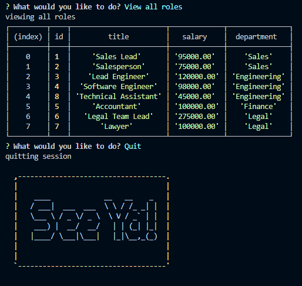

<<<<<<< HEAD

  # My Employee Tracker

  ## Description

  A command-line application to manage a company's employee database, using Node.js, Inquirer, and MySQL.
=======
# Employee Tracker Database

## Description

A command-line application to manage a complany's employee database, using Node.js, Inquirer, and MySQL

>>>>>>> feature/db

  ## Table of Contents

  * [Installation](#installation)
  * [Usage](#usage)
  * [License](#license)
  * [Contribution](#contribution)
  * [Questions](#questions) 
  
  ## Installation
<<<<<<< HEAD
  Initiate a clone or pull of a project's repo onto your local machine, then change directory to file location, then run installation for dependencies such as Inquirer, Figlet, Console.Table, MySQL2.

  ## Usage
  Type into the terminal command line: 'node server' to initiate the program.

  Navigate with arrow keys and press [ENTER] once on the appropriate input field. Utilize [QUIT] to exit the application once done adding, removing, or updating employees in the tracker.

   
  
   

  ## License
  This project is covered by the MIT license. 
  
  
  
  ## Contribution
  Contributor Covenant 2.0 available at https://www.contributor-covenant.org/

  ## Questions
  Visit my GitHub [Devmadia](https://github.com/Devmadia)

  If you have any additional questions not answered here or wish to contact me regarding developments, please email me at 
  [thedevmadia@gmail.com](mailto:thedevmadia@gmail.com)
  
=======
  Initiate a clone or pull of a project's repo onto your local machine, then change directory to file location and run installation for dependencies by typing `npm install` in the root directory terminal window.

  ## Usage
  Before doing anything, be sure to run the schema.sql  and seeds.sql files to get your MySQL database created. You will need to know how to use MySQL and have it installed for this.

  Video Walk-Through: [Employee Tracker Database](https://drive.google.com/file/d/1cf7VskDsLnFPb7cKV4sPUeKt8JwacaDI/view)

 

  Once everything is installed, users can run the application by typing `node server.js` in the terminal window of the root directory the Employee Tracker Database was installed in. A detail should pop up in the terminal window similar to the screenshot above with options available for selection through keyboard arrow keys.

 

  User can navigate through the various screens to view all departments, roles, and employees at their leisure.

      

  Users can opt to update the database through the terminal selection by adding new departments, roles, and employees. Prompts will automatically render in the terminal dependent on the option selected.

    

  There are available options to update employees as well.

   

  When a user is finished, they may quit the application through the menu option and confirm their session termination through the ascii artwork rendering `See Ya!`.

  ## License
   This project is covered by the MIT license.

  ## Contributing
  At this time, I am not seeking contributors to my Employee Tracker Database.

  ## Questions
  Please contact Devmadia by clicking below for immediate questions regarding site content:

  

  For other projects by Devmadia [click here](https://github.com/Devmadia)
>>>>>>> feature/db
